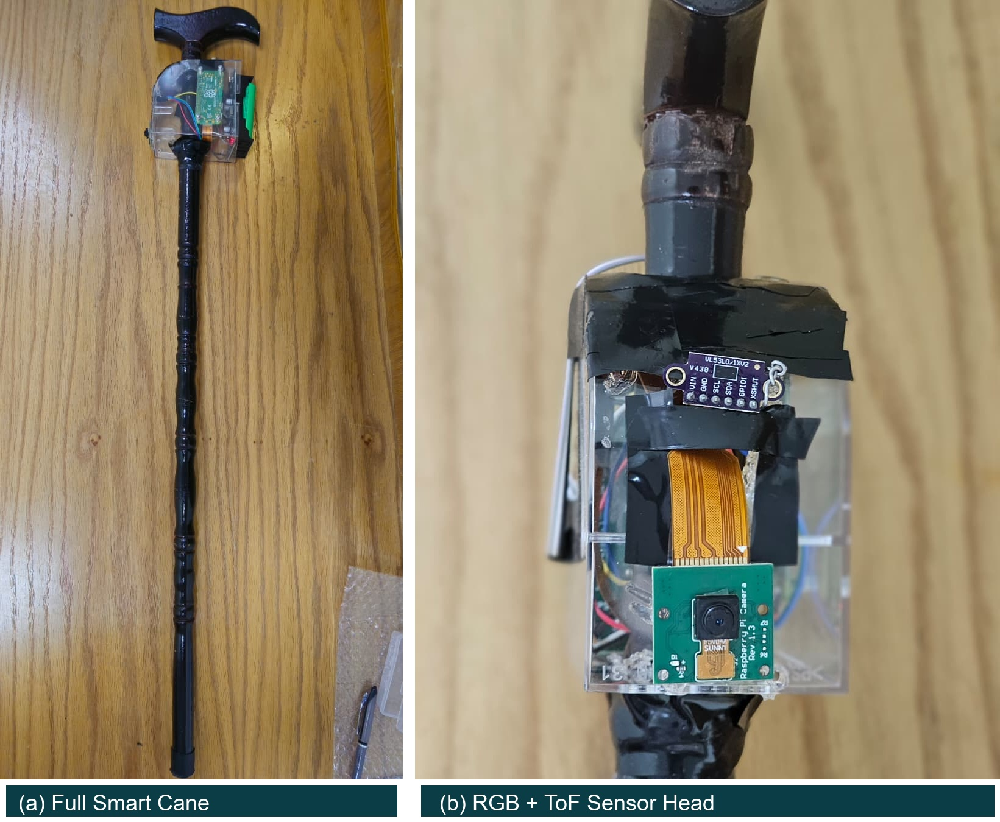
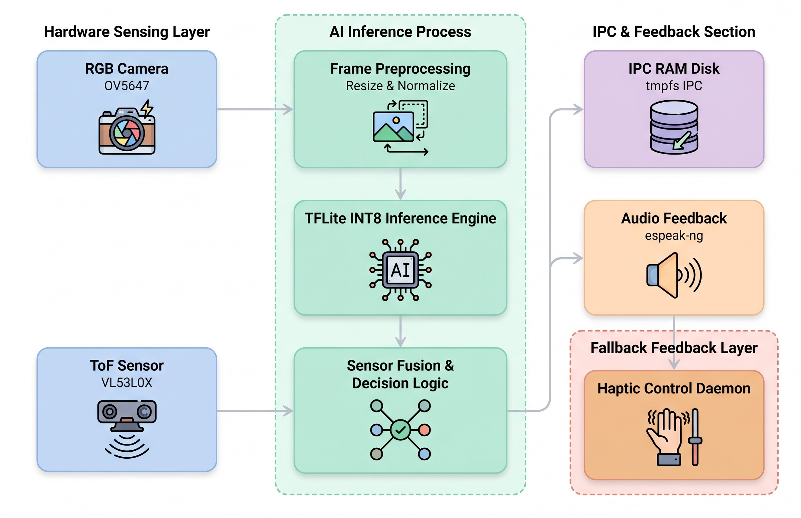
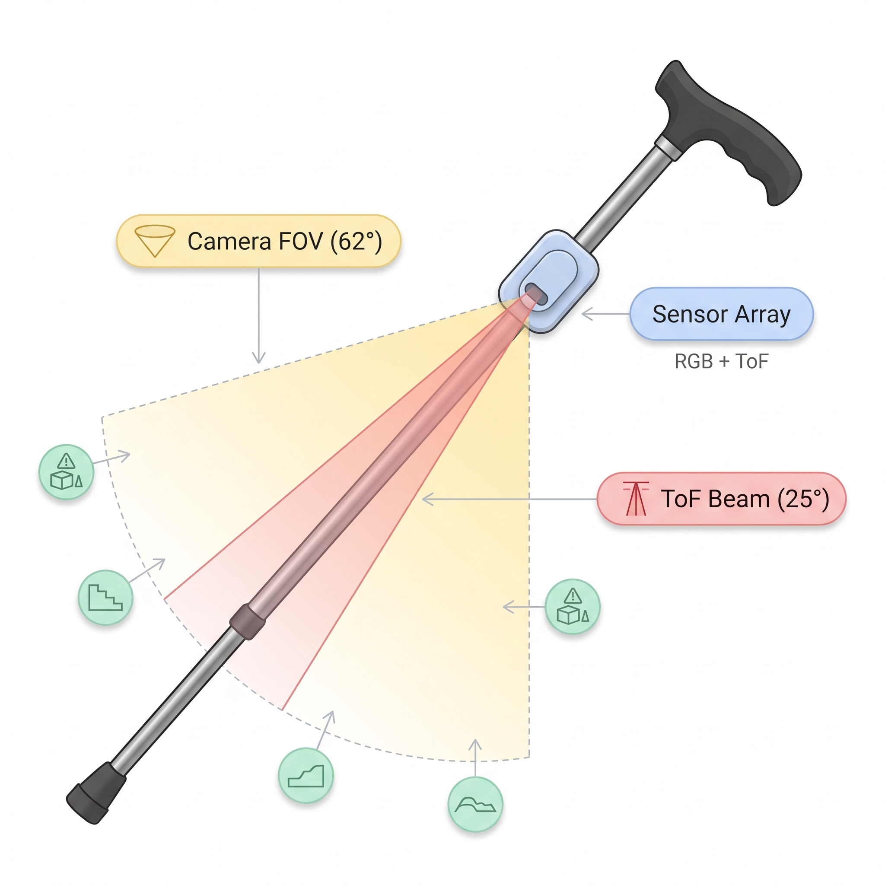
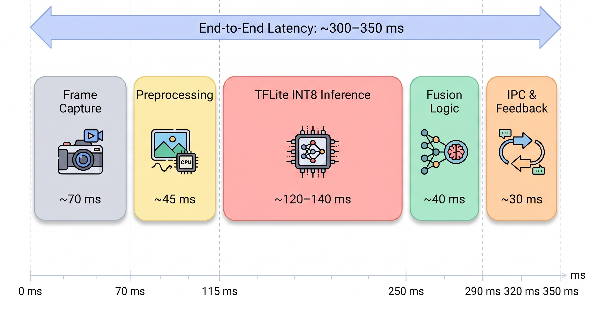

# VisionBridge AI: Affordable Smart Cane for Multimodal Mobility Assistance of Visually Impaired Users

<div align="center">

[](https://opensource.org/licenses/MIT)
[](https://www.raspberrypi.com/products/raspberry-pi-zero-2-w/)
[](https://www.tensorflow.org/lite)
[]()
[]()
[]()
[](https://hackathon.kscdr.org)

**An ultra-low-power, edge-native assistive mobility system combining real-time computer vision, Time-of-Flight distance sensing, and multimodal (haptic + verbal) feedback — operating 100% offline.**

[Overview](#1-project-overview--healthcare-significance) • [Key Capabilities](#2-key-capabilities--engineering-highlights) • [Visual Gallery](#3-physical-prototype--visual-gallery) • [System Architecture](#4-system-architecture--multiprocessing-safety-layer) • [Hardware & Wiring](#5-hardware-bill-of-materials--electrical-wiring) • [Feedback Protocol](#6-multimodal-assistive-feedback-protocol) • [Edge-AI Pipeline](#7-embedded-edge-ai-optimization-pipeline) • [Benchmarks](#8-empirical-evaluation--benchmark-results) • [Failure Analysis](#9-failure-modes--operational-boundaries) • [Installation](#10-installation--deployment-guide) • [Diagnostics](#11-hardware-verification--diagnostics) • [Repository Structure](#12-repository-directory-tree) • [Troubleshooting](#13-troubleshooting--common-issues) • [Citation](#14-citation) • [License](#15-license)

---

</div>

## 1. Project Overview & Healthcare Significance

According to the World Health Organization (WHO), over **2.2 billion people** worldwide live with vision impairment. While traditional white canes provide reliable tactile feedback for ground-level obstacles, they inherently fail to detect **elevated hazards** (such as hanging signage, tree branches, or open windows) and convey **zero semantic awareness** regarding obstacle categories. Existing commercial electronic travel aids (e.g., OrCam MyEye) cost upwards of **$3,500 to $4,500+**, remaining inaccessible in low-resource settings. Conversely, cloud-assisted smartphone solutions introduce variable communication latency, battery drain, and critical privacy vulnerabilities in public spaces.

**VisionBridge AI** is an affordable, fully edge-native smart cane engineered on ultra-low-power embedded hardware. Built around a **Raspberry Pi Zero 2W (512 MB RAM)**, the system fuses RGB computer vision with Time-of-Flight (ToF) laser rangefinding to deliver multimodal environmental awareness. Operating entirely offline without cloud dependencies, it features:
- **Spatial Semantic Ranging:** Millimeter-accurate distance measurement fused with localized semantic object identification.
- **Multimodal Assistive Delivery:** Distance-tiered vibrotactile alerts delivered directly through the cane grip, paired with concise verbal notifications via Bluetooth.
- **Extreme Cost Efficiency:** A complete prototype bill of materials (BOM) cost of approximately **$88 USD**, providing an open-source, reproducible alternative for assistive healthcare in low-resource environments.

---

## 2. Key Capabilities & Engineering Highlights

- **100% Edge-Native Offline Operation:** All neural inference, sensor polling, and audio synthesis execute locally on-device. No images, telemetry, or user data leave the hardware, guaranteeing privacy in public settings.
- **Asynchronous Multiprocessing Isolation:** Decouples sensor acquisition and neural inference from the haptic feedback pipeline. A dedicated background daemon guarantees that tactile proximity alerts continue without interruption, even during inference slowdowns.
- **Quantized INT8 Edge Inference:** Quantized SSD MobileNet V1 model occupies only **4.8 MB** in storage (compared to 22.5 MB in FP32 and 7.2 MB for MobileNet V2), fitting within the tight 512 MB shared RAM ceiling with only a 1.5% drop in macro F1-score.
- **Coaxial Multimodal Sensing:** Combines a $62^\circ$ FOV RGB camera with a $25^\circ$ Time-of-Flight infrared laser sensor tilted coaxially at $45^\circ$, enabling simultaneous forward path interpretation and elevated hazard tracking.
- **Fail-Safe Operational Fallback:** If visual inference confidence degrades due to rolling-shutter motion blur or dim lighting, the independent 20 Hz ToF laser rangefinder maintains active distance warnings autonomously.
- **Zero-Configuration Headless Boot:** An integrated `systemd` service manages automated startup, process cleanup, and Bluetooth audio auto-connection, bringing the cane into an active assistive state within 50–60 seconds of power-on.

---

## 3. Physical Prototype & Visual Gallery

The hardware platform is integrated onto a standard 120 cm aluminum white cane to preserve familiar mobility dynamics and sweeping techniques without requiring intensive user retraining.

<div align="center">
  
  <p><em>Figure 1: (a) Full functional smart cane prototype, (b) 3D-printed embedded controller enclosure, (c) Coaxial RGB camera and VL53L0X ToF sensor head, and (d) Handle-embedded ERM vibration motor.</em></p>
</div>

- **Controller Enclosure:** Compact 3D-printed housing mounted near the cane grip to optimize center-of-mass balance and minimize wrist fatigue during prolonged sweeping.
- **Total Prototype Weight:** Approximately **380 g** (excluding base cane structure).
- **Sensor Head:** Rigid coaxial bracket orienting both the camera and laser rangefinder downward at an angle of $45^\circ$.

---

## 4. System Architecture & Multiprocessing Safety Layer

Under high CPU utilization, monolithic or single-threaded embedded architectures frequently delay GPIO toggling or freeze tactile cues. VisionBridge AI resolves this using an **asynchronous multiprocessing safety architecture**:

<div align="center">
  
  <p><em>Figure 2: Multiprocessing dataflow architecture separating camera acquisition, neural inference, verbal synthesis, and the standalone haptic daemon via volatile in-memory IPC.</em></p>
</div>

### Architectural Separation
1. **Perception & Inference Engine (`scripts/ai_tflite_inference.py` / `scripts/ai_test_picamera2.py`):**
   - Captures $320 \times 240$ RGB frames via `Picamera2`.
   - Executes visual inference on every third captured frame (**fixed modulo-3 frame skipping policy**, $f_{\text{infer}} \approx 2\text{--}3\text{ FPS}$) to preserve CPU thermal stability.
   - Polls the ST VL53L0X ToF sensor via I2C at **20 Hz** independently of the visual pipeline.
   - Dispatches rate-limited speech synthesis commands to `espeak-ng` via Bluetooth.
   - Writes distance tier commands (`0` to `4`) into `/tmp/motor_cmd`.
2. **In-Memory IPC Mechanism (`tmpfs`):**
   - Commands are passed through `/tmp/motor_cmd`, residing entirely in volatile RAM (`tmpfs`). This eliminates SD card write cycles, prevents storage wear, and guarantees microsecond IPC access latency.
3. **Independent Haptic Daemon (`scripts/motor_process.py`):**
   - Operates as a separate Linux process monitoring `/tmp/motor_cmd`.
   - Directly drives GPIO 18 using hardware-accurate pulse timings.
   - **Autonomous Failsafe:** When visual detection confidence falls below 0.50, proximity warnings are sustained purely through ToF laser ranging.
   - **Temporal Persistence Window:** Implements a 3.0-second state-hold buffer to smooth rapid signal fluctuations during user sweeping motions.

---

## 5. Hardware Bill of Materials & Electrical Wiring

### Bill of Materials (BOM)

| Component | Specification / Model | Interface | Role in System | Approx. Cost (USD) |
| :--- | :--- | :--- | :--- | :---: |
| **Embedded SBC** | Raspberry Pi Zero 2W (Quad-core ARM Cortex-A53 @ 1.0 GHz, 512 MB RAM) | CSI / I2C / GPIO | On-device edge AI inference & sensor orchestration | $15.00 |
| **RGB Camera** | Raspberry Pi Camera Module (OmniVision OV5647, 5 MP, $62^\circ$ FOV) | 15-pin CSI | Real-time semantic obstacle detection | $9.00 |
| **Distance Sensor** | STMicroelectronics VL53L0X Time-of-Flight (ToF) Laser Sensor | I2C (Bus 1, `0x29`) | Millimeter-accurate distance ranging (10–2000 mm) | $6.00 |
| **Haptic Actuator** | DC Eccentric Rotating Mass (ERM) Vibration Motor (3V–5V) | GPIO 18 (PWM/DO) | Tactile proximity alerts embedded in handle grip | $3.00 |
| **Audio Interface** | Bluetooth Wireless In-Ear Earphones | Bluetooth / PulseAudio | Concise verbal notifications and obstacle labeling | $12.00 |
| **Storage** | 32 GB SanDisk Ultra MicroSD Card (Class 10 / A1) | SDIO | OS boot, quantized model storage, and runtimes | $8.00 |
| **Power Pack** | Dual-cell 5000 mAh Li-ion Battery Pack + 5V Step-Up Module | Micro-USB | Standalone portable operation (~3–4 hours runtime) | $15.00 |
| **Structural Frame** | Standard 120 cm Folding Aluminum White Cane | Mechanical | Baseline tactile ground navigation chassis | $12.00 |
| **Enclosure** | Custom 3D-Printed PLA Enclosure + Coaxial Mount Bracket | Custom | Protective chassis (~380 g total payload) | $8.00 |
| **Total BOM Cost** | | | | **~$88.00 USD** |

### Electrical Wiring & Pinout

<div align="center">
  
  <p><em>Figure 3: Coaxial sensor mounting ($45^\circ$ downward tilt) comparing the $62^\circ$ camera FOV with the focused $25^\circ$ ToF cone.</em></p>
</div>

```text
                  Raspberry Pi Zero 2W 40-Pin GPIO Header
                                   +-----+
          3.3V Power (Pin 1) [ o ] | o   | Pin 2  [ 5V Power -> Motor VCC ]
     I2C1 SDA (GPIO 2, Pin 3) [ o ] | o   | Pin 4  [ 5V Power ]
     I2C1 SCL (GPIO 3, Pin 5) [ o ] | o   | Pin 6  [ Ground   -> VL53L0X GND ]
                              | o   | o   | Pin 8  [ GPIO 14 (UART TX) ]
         Ground (Pin 9) [ o ] | o   | Pin 10 [ GPIO 15 (UART RX) ]
                              | o   | [ o ] Pin 12 [ GPIO 18   -> Motor Signal ]
                                   +-----+
```

| Physical Pin | BCM GPIO | Pin Function | Target Component | Wire / Signal Description |
| :---: | :---: | :---: | :--- | :--- |
| **Pin 1** | --- | 3.3V Power | ST VL53L0X Sensor | `VIN` Power Supply |
| **Pin 3** | GPIO 2 | I2C1 SDA | ST VL53L0X Sensor | `SDA` Data Line |
| **Pin 5** | GPIO 3 | I2C1 SCL | ST VL53L0X Sensor | `SCL` Clock Line |
| **Pin 6** | --- | Ground | ST VL53L0X Sensor | `GND` Common Ground |
| **Pin 2** | --- | 5.0V Power | ERM Vibration Motor | `VCC` Motor Drive Power |
| **Pin 9** | --- | Ground | ERM Vibration Motor | `GND` Common Ground |
| **Pin 12**| GPIO 18| GPIO OUT / PWM | ERM Vibration Motor | Control Signal Line |

---

## 6. Multimodal Assistive Feedback Protocol

VisionBridge AI employs an event-driven, distance-tiered multimodal feedback strategy to prevent cognitive overload and maintain user auditory awareness of ambient environmental cues.

### Vibrotactile Proximity Tiers (Table II from IEEE Publication)

| Proximity Zone | Distance Range | Pulse Duration | Pulse Interval | Alert Priority | Perceptual Cue |
| :--- | :---: | :---: | :---: | :---: | :--- |
| **Zone 1: Critical Proximity** | **$< 50\text{ cm}$** | **500 ms** | **100 ms** | **Critical** | Rapid, urgent buzz cadence requiring immediate stop |
| **Zone 2: High Caution** | **$50\text{--}80\text{ cm}$** | **300 ms** | **200 ms** | **High** | Distinct pulsing signaling imminent obstacle |
| **Zone 3: Navigation Awareness**| **$80\text{--}120\text{ cm}$**| **200 ms** | **400 ms** | **Moderate** | Moderate pulse cadence for spatial path adjustment |
| **Zone 4: Distant Detection** | **$120\text{--}150\text{ cm}$**| **100 ms** | **800 ms** | **Low** | Light periodic tap notifying of forward obstacle |
| **Zone 5: Clear Path** | **$> 150\text{ cm}$** | *Motor OFF* | --- | **Informational** | Tactile silence; verbal alerts only (prevents numbness) |

### Semantic Audio Feedback (Bluetooth)

- **Semantic Object Announcements:** When a target obstacle is detected with confidence $\ge 0.50$, the system synthesizes:  
  `"{Class Name} {Distance} centimeters"` *(e.g., "Person 80 centimeters", "Chair 110 centimeters")*.
- **Autonomous Obstacle Fallback:** If visual recognition is unconfident or occluded but the ToF sensor detects an obstruction $\le 80$ cm, the system announces:  
  `"Obstacle {Distance} centimeters"`.
- **Cognitive Protection Cooldown:** Spoken notifications enforce an independent **4.0-second cooldown** per obstacle category, preventing verbal saturation and auditory masking.

---

## 7. Embedded Edge-AI Optimization Pipeline

Deploying neural object detection on the Raspberry Pi Zero 2W is constrained by its 512 MB shared RAM and the absence of hardware NPU acceleration.

```text
+-------------------+      +-------------------------+      +------------------------+
| Camera Frame      | ---> | Fixed Modulo-3 Skipping | ---> | TFLite INT8 Inference  |
| 320x240 @ 10 FPS  |      | finfer ≈ 2-3 FPS        |      | SSD MobileNet V1       |
+-------------------+      +-------------------------+      +------------------------+
                                                                        |
                                                                        v
+-------------------+      +-------------------------+      +------------------------+
| Haptic Feedback   | <--- | tmpfs IPC Buffer        | <--- | Bounding Box & Class   |
| (motor_process.py)|      | /tmp/motor_cmd          |      | Confidence >= 0.50     |
+-------------------+      +-------------------------+      +------------------------+
```

1. **Quantization & Footprint Reduction:**
   - The SSD MobileNet V1 model was converted using TensorFlow Lite Post-Training Quantization (**INT8 PTQ**), compressing weights from FP32 to 8-bit integers.
   - Storage footprint shrank from **22.5 MB to 4.8 MB** (significantly smaller than MobileNet V2 at 7.2 MB), fitting comfortably into memory during multi-process execution.
   - Quantization degradation was measured at only **1.5 percentage points** macro F1-score relative to the FP32 baseline.
2. **Inference Scheduling & Thermal Throttling Prevention:**
   - Semantic inference executes once every three captured frames ($f_{\text{infer}} = f_{\text{capture}} / 3 \approx 2\text{--}3\text{ FPS}$).
   - This keeps CPU load within stable operational bounds (60–70% inference utilization), stabilizing core temperatures at $65^\circ\text{C to } 70^\circ\text{C}$ without active heatsinks or fans.
   - Concurrently, the ToF sensor maintains continuous proximity polling at **20 Hz**.

---

## 8. Empirical Evaluation & Benchmark Results

The system was evaluated across technical, mobility-oriented, and usability dimensions in realistic indoor environments.

### 1. Semantic Obstacle Detection Accuracy

Evaluated on a custom indoor benchmark comprising **600 manually annotated obstacle encounters** across 5 categories ($N \approx 120$ per class):

| Obstacle Category | Precision | Recall | F1-Score | False Positives / 100 Neg. |
| :--- | :---: | :---: | :---: | :---: |
| **Person (Pedestrian Encounter)** | **0.94** | **0.91** | **0.92** | **1.7** |
| **Chair (Cluttered Pathway)** | **0.88** | **0.85** | **0.86** | **3.3** |
| **Desk / Table (Corridor Obstruction)** | **0.86** | **0.82** | **0.84** | **4.2** |
| **Doorway / Opening** | **0.82** | **0.79** | **0.80** | **5.8** |
| **Potted Plant (Irregular Hazard)** | **0.75** | **0.68** | **0.71** | **7.5** |
| **Macro Average / Overall** | **0.85** | **0.81** | **0.82** | **~83.5% Overall Accuracy** |

### 2. Mobility Obstacle Avoidance Success Rate

Mobility trials evaluated $N=30$ runs per obstacle scenario with **95% Wilson Score Confidence Intervals**:

| Mobility Scenario | Avoidance Rate (95% CI) | Successful / Total | Mean User Reaction Time |
| :--- | :---: | :---: | :---: |
| **Cluttered Corridor Navigation** | **93.3%** [78.7%, 98.1%] | 28 / 30 | 1.1 s |
| **Elevated Hazard Avoidance (Overhangs)** | **86.7%** [70.3%, 94.7%] | 26 / 30 | 1.4 s |
| **Dynamic Pedestrian Encounter** | **80.0%** [62.7%, 90.5%] | 24 / 30 | 1.8 s |
| **Overall Mobility Avoidance** | **86.7%** [77.5%, 92.6%] | **78 / 90** | **1.43 s** |

### 3. Edge Hardware Resource Profiling

Tested continuously on Raspberry Pi Zero 2W running Raspberry Pi OS Lite Bookworm (64-bit):

| Subsystem Component | CPU Utilization (%) | Memory Footprint (MB) | Power Consumption (W) |
| :--- | :---: | :---: | :---: |
| **Background OS Services** | 7–10% | 105–120 MB | 0.7–0.9 W |
| **Camera Acquisition (`Picamera2`)** | 12–18% | 40–50 MB | 0.3–0.5 W |
| **TFLite INT8 Inference Engine** | 60–70% | 170–190 MB | 1.1–1.3 W |
| **ToF Polling & Haptic Daemon** | 1–3% | 6–10 MB | 0.3–0.4 W |
| **Peak Concurrent System Load** | **85–92%** | **330–360 MB** | **2.6–2.9 W (~2.8 W Avg)** |

<div align="center">
  
  <p><em>Figure 4: Measured end-to-end response latency timeline breakdown (~330 ms total).</em></p>
</div>

- **End-to-End Latency:** Mean response latency is **~330 ms** (range 300–350 ms). At an average walking pace of 1.1–1.3 m/s, this equates to roughly 35–45 cm of forward user movement before alert delivery.
- **Thermal Behavior:** Core CPU temperature stabilized between **$65^\circ\text{C}$ and $70^\circ\text{C}$** without active cooling during continuous 2-hour stress testing ($24^\circ$C ambient).

### 4. Usability Assessment & Perceived Workload

Evaluated with $N=12$ blindfolded participants across indoor obstacle navigation courses:
- **System Usability Scale (SUS):** **78.5 ($\pm$4.2)** [95% CI: 71.0, 86.0] — exceeds the standard **68.0** industry benchmark for above-average usability.
- **NASA-TLX Mental Demand:** **45 / 100** (moderate cognitive workload).
- **NASA-TLX Frustration:** **22 / 100** (low user frustration).
- **Perceived Safety Rating:** **4.2 / 5.0** (positive user trust and confidence).

---

## 9. Failure Modes & Operational Boundaries

In accordance with rigorous scientific practices, the operational failure boundaries of the prototype were cataloged:

1. **Rapid Sweeping Motion ($>1.5\text{ m/s}$):** Fast cane sweeps induce rolling-shutter motion blur on the low-cost OV5647 camera, occasionally dropping AI detection confidence below 0.50.  
   *Current Mitigation:* The independent 20 Hz ToF laser sensor provides an autonomous proximity safety net.
2. **Extreme Low Light / Darkness:** RGB vision degrades under insufficient ambient illumination. The system transitions reliance entirely to active infrared ToF ranging.
3. **Specular & Glass Surfaces:** Specular laser reflections on transparent glass doors or high-gloss surfaces can produce distorted distance estimates.
4. **Field-of-View Boundaries:** The camera ($62^\circ$) and ToF ($25^\circ$) do not provide peripheral side or rear coverage.
5. **Language Output:** Verbal announcements are currently synthesized in English only (Arabic language support is in development).

---

## 10. Installation & Deployment Guide

> [!IMPORTANT]
> The execution codebase requires physical hardware access (`/dev/i2c-1`, `/dev/video*`, and `RPi.GPIO`). Running on non-Raspberry Pi environments (e.g., standard x86 workstations) will allow code inspection but will fail during hardware sensor initialization.

### Prerequisites
- Raspberry Pi Zero 2W.
- **Raspberry Pi OS Lite (64-bit Bookworm)** flashed to a $\ge 16$ GB MicroSD card.
- SSH enabled; I2C and Camera interfaces enabled via `sudo raspi-config`.

### Step 1: System Package Installation
```bash
sudo apt update && sudo apt upgrade -y
sudo apt install -y python3-opencv python3-picamera2 python3-libcamera \
                    espeak-ng i2c-tools pulseaudio bluetooth bluez
pip3 install smbus2 RPi.GPIO --break-system-packages
```

### Step 2: Model Installation

You can run either the quantized TensorFlow Lite model (recommended for publication-matching performance) or the OpenCV DNN frozen inference graph:

#### Option A: Quantized INT8 TFLite Model (Recommended)
```bash
mkdir -p /home/pi/model
cd /home/pi/model
wget https://storage.googleapis.com/download.tensorflow.org/models/tflite/coco_ssd_mobilenet_v1_1.0_quant_2018_06_29.zip
unzip coco_ssd_mobilenet_v1_1.0_quant_2018_06_29.zip -d /home/pi/model/
mv /home/pi/model/detect.tflite /home/pi/model/ssd_mobilenet_v1_coco_quant_postprocess.tflite
```

#### Option B: OpenCV DNN Frozen Graph (Prototype Script)
```bash
mkdir -p /home/pi/model/ssd_mobilenet_v1_coco_2017_11_17
cd /home/pi/model/ssd_mobilenet_v1_coco_2017_11_17
wget http://download.tensorflow.org/models/object_detection/ssd_mobilenet_v1_coco_2017_11_17.tar.gz
tar -xvzf ssd_mobilenet_v1_coco_2017_11_17.tar.gz --strip-components=1
wget -O ssd_mobilenet_v1_coco.pbtxt https://raw.githubusercontent.com/opencv/opencv_extra/master/testdata/dnn/ssd_mobilenet_v1_coco_2017_11_17.pbtxt
```

### Step 3: Deploy Scripts & Bluetooth Configuration
```bash
# Clone the repository
git clone https://github.com/adeliusa486/smart-obstacle-cane.git

# Copy scripts to target home directory
cp smart-obstacle-cane/scripts/* /home/pi/
chmod +x /home/pi/*.sh /home/pi/*.py

# Configure your Bluetooth Headphone MAC address
nano /home/pi/bt_connect.sh
```

> [!NOTE]
> Inside `/home/pi/bt_connect.sh`, replace `MAC=" B0:38:E2:19:DC:CC"` with your specific headset MAC address (discovered via `bluetoothctl scan on`).

### Step 4: Configure systemd Auto-Start Service
```bash
sudo cp smart-obstacle-cane/smartcane.service /etc/systemd/system/
sudo systemctl daemon-reload
sudo systemctl enable smartcane.service
sudo reboot
```

---

## 11. Hardware Verification & Diagnostics

Use these diagnostic checkpoints to independently verify subsystems before enabling the automated service:

### 1. Camera Interface Verification
```bash
rpicam-still --list-cameras
```
*Expected Output:* Displays detected camera sensor (e.g., `ov5647 [2592x1944 10-bit]`).

### 2. Time-of-Flight I2C Bus Detection
```bash
sudo i2cdetect -y 1
```
*Expected Output:* A grid showing address `29` on row `20`.

### 3. Manual Haptic Motor Test
In a terminal, test the standalone motor daemon:
```bash
# Start motor daemon in background
python3 /home/pi/motor_process.py &

# Send a Tier 4 (Critical) haptic command
echo "4" > /tmp/motor_cmd

# Stop motor
echo "0" > /tmp/motor_cmd
```

### 4. Monitor Live Service Logs
```bash
tail -f /home/pi/smartcane.log
```

---

## 12. Repository Directory Tree

```text
smart-obstacle-cane/
├── README.md                   # Comprehensive publication-grade technical documentation
├── LICENSE                     # MIT License file
├── smartcane.service           # systemd unit for zero-config headless auto-boot
├── .gitignore                  # Git tracking exclusion rules
├── media/                      # Tracked publication diagrams and prototype photos
│   ├── architecture.jpeg       # Multiprocessing system architecture schematic
│   ├── sensor_placement.jpeg   # Coaxial sensor mounting & FOV comparison diagram
│   ├── latency_breakdown.jpeg  # Measured end-to-end latency timeline breakdown
│   ├── prototype_composite.jpg # Multi-view prototype photo composite
│   ├── poster_render.png       # KSCDR Hackathon A0 scientific poster render
│   ├── qr_code.png             # Direct repository access QR code
│   ├── full_device.jpg         # Full smart cane assembly photograph
│   ├── camera_ir_sensor.jpg    # Coaxial camera and ToF sensor head photograph
│   ├── vibration_motor.jpg     # ERM haptic motor integration photograph
│   └── ai_smart_cane.jpg       # Enclosure and controller view photograph
└── scripts/                    # Embedded execution codebase
    ├── ai_tflite_inference.py  # Quantized INT8 TFLite perception & feedback pipeline
    ├── ai_test_picamera2.py    # OpenCV DNN detection script (prototype fallback)
    ├── motor_process.py        # Standalone 4-tier haptic daemon via tmpfs IPC
    ├── bt_connect.sh           # Headless Bluetooth audio auto-connect script
    └── start_smartcane.sh      # Process cleanup and service execution wrapper
```

---

## 13. Troubleshooting & Common Issues

| Symptom | Probable Cause | Corrective Action |
| :--- | :--- | :--- |
| **`Sensor ID wrong` in log** | I2C wiring issue or incorrect sensor supply voltage | Verify VL53L0X is connected to 3.3V (Pin 1), not 5V. Run `sudo i2cdetect -y 1` to verify address `0x29`. |
| **`Camera failed. Exiting.`** | CSI ribbon cable inverted or loose; camera claimed by background process | Check cable orientation (contacts face PCB). Run `sudo fuser -k /dev/video*` to free locked devices. |
| **Audio fails to speak** | Bluetooth headset not connected or PulseAudio runtime missing | Verify headphone is powered on before boot. Ensure `PULSE_RUNTIME_PATH=/run/user/1000/pulse` is exported. |
| **Motor does not vibrate** | Loose ground or signal wire; `/tmp/motor_cmd` permission issue | Verify signal wire is on GPIO 18 (Pin 12). Test motor directly with `echo 4 > /tmp/motor_cmd`. |

---

## 14. Citation

If you use VisionBridge AI, this repository, or its hardware architecture in your work or research, please cite this repository:

```bibtex
@misc{smart_obstacle_cane_2026,
  author       = {Ahmad, Adeel and Akarma, Ali},
  title        = {VisionBridge AI: An Affordable {AI}-Integrated Smart Cane for Multimodal Mobility Assistance of Visually Impaired Users},
  year         = {2026},
  publisher    = {GitHub},
  journal      = {GitHub repository},
  howpublished = {\url{https://github.com/adeliusa486/smart-obstacle-cane}}
}
```

### Authors & Repository Developers
- **Adeel Ahmad** ([443057803@stu.iu.edu.sa](mailto:443057803@stu.iu.edu.sa))  
  *AI Center, Faculty of Computer and Information Systems, Islamic University of Madinah, Saudi Arabia*
- **Ali Akarma** ([443059463@stu.iu.edu.sa](mailto:443059463@stu.iu.edu.sa))  
  *AI Center, Faculty of Computer and Information Systems, Islamic University of Madinah, Saudi Arabia*  
  *AI V&V Lab, King Fahd University of Petroleum and Minerals (KFUPM), Dhahran, Saudi Arabia*

### Academic Supervision
- **Dr. Toqeer Ali Syed** ([toqeer@iu.edu.sa](mailto:toqeer@iu.edu.sa))  
  *Faculty Supervisor, AI Center, Islamic University of Madinah, Saudi Arabia*

### Hackathon Recognition
- **Event:** AI Hackathon for People with Disabilities  
- **Organized By:** King Salman Center for Disability Research (KSCDR), Riyadh, Saudi Arabia  
- **Team Identifier:** `KSCDR_Hackathon_101` (Team VisionBridge AI)  
- **Track & Category:** Everyday Life & Assistive Technologies (Individuals Category)

---

## 15. License

This project is licensed under the [MIT License](LICENSE) — you are free to inspect, adapt, and build upon this assistive technology with appropriate academic attribution.
